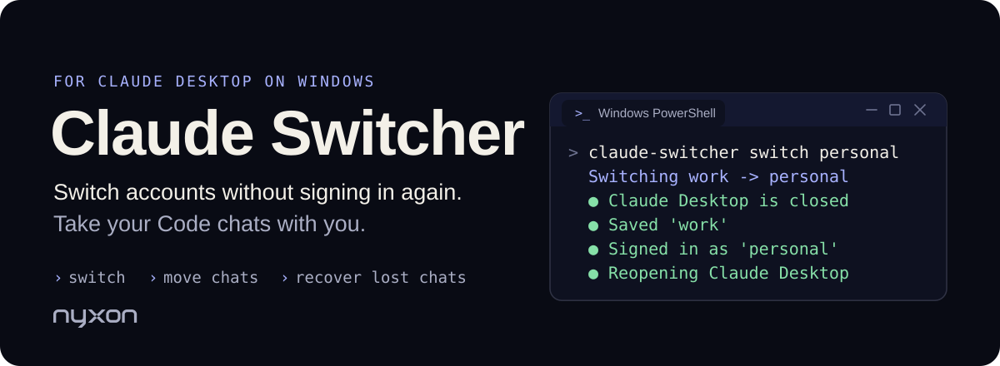
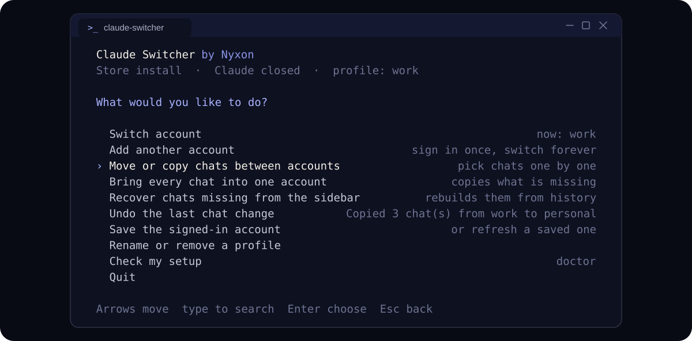
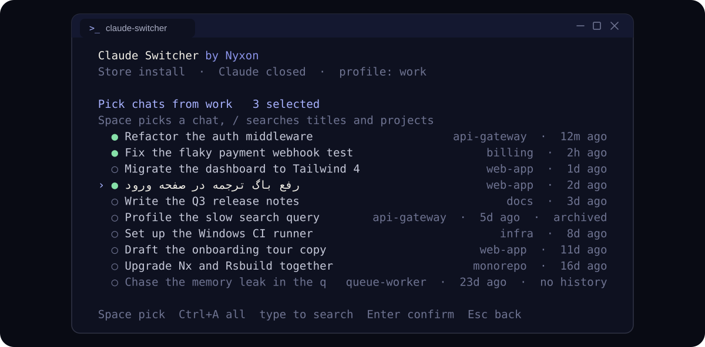
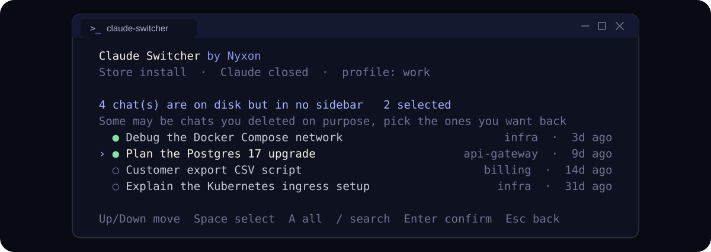
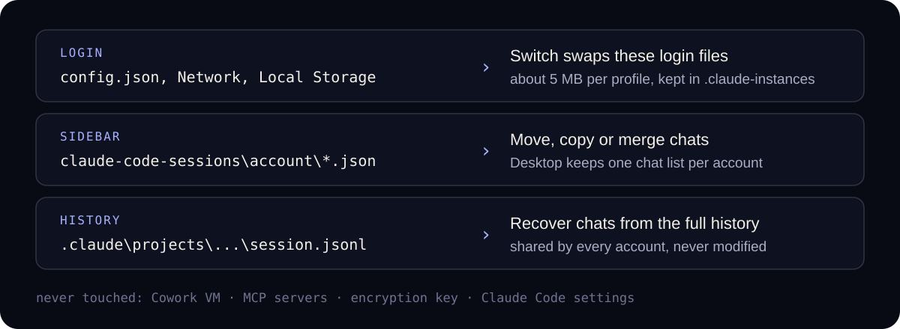

<p align="center">
  
</p>

<p align="center">
  <a href="https://github.com/nyxon-tech/claude-switcher/actions/workflows/test.yml"></a>
  
  
  
  <a href="./LICENSE"></a>
</p>

Claude Desktop is signed into one account at a time. Switching means logging out and back in, and every account keeps its own Code sidebar, so the chats you had a minute ago look gone.

**Claude Switcher** saves each login once, switches between them in seconds, and moves your Claude Code chats to whichever account you are using. It is one PowerShell file with no dependencies, it never talks to the network, and every chat change can be undone.

```powershell
irm https://raw.githubusercontent.com/nyxon-tech/claude-switcher/main/install.ps1 | iex
```

Then open a new terminal and run `claude-switcher`.

## Everything is one menu

<p align="center">
  
</p>

Arrow keys to move, Enter to choose, just start typing to search, Esc to go back. Every item is also a command for scripts.

## Move exactly the chats you want

<p align="center">
  
</p>

Pick an account, tick chats with Space (Ctrl+A for all), choose where they go, then **copy** them (they show up in both accounts) or **move** them (they leave the first one). Titles in any language work, and chats whose history Claude Code already deleted are marked so you can leave them behind.

## Get lost chats back

<p align="center">
  
</p>

Claude Code keeps every conversation in `%USERPROFILE%\.claude\projects`, but the sidebar only shows chats it has a record for. After an account switch, a reinstall, or a sync trick that went wrong, those records go missing while the history is still there. **Recover** finds every history no account lists and rebuilds its sidebar entry with the right title, project, model and dates. A Desktop chat is often several history files (a `/clear` or a restart starts a new one under the same title), so older parts of chats you still have, and chats you deleted in the app, are left out, and a lost chat comes back once. Sessions you ran in a terminal show up too.

## What you can do

| Feature | What it does |
| --- | --- |
| **Switch account** | Swap to another saved login and reopen Claude Desktop. No password, no email code. |
| **Add an account** | Saves the current login, then opens Desktop signed out so you can add the next one, without ever pressing Log out. |
| **Move or copy chats** | Chat by chat, with search, between any two accounts on this PC. |
| **Merge** | Copy every chat an account is missing from all the others in one go. |
| **Recover** | Rebuild sidebar entries for chats that only exist as history on disk. |
| **Undo** | Reverse the last move, copy, merge or recovery exactly. |
| **Doctor** | Checks the install, the signed-in account and every chat list, and warns about settings that silently delete history. |

## How it works

Claude Desktop keeps three things on disk, and Claude Switcher treats each one differently.

<p align="center">
  
</p>

- **Switching** copies about 5 MB of login files (`config.json`, cookies, local storage) between Desktop's data folder and `%USERPROFILE%\.claude-instances\<profile>`. Desktop has to be closed for this, because it rewrites those files when it quits, so Claude Switcher asks you to quit it from the tray and reopens it afterwards.
- **Chats** live in two places. The history is one file per conversation, shared by every account. The sidebar is a small record per chat, kept in a separate folder for each account. Moving a chat moves that record; the history is only ever read.
- **Safety rails.** Before overwriting a saved login it checks that Desktop is still signed into that same account, and refuses otherwise. Every chat change writes a journal with backups, so `undo` puts things back byte for byte. Records are written the way Desktop expects them (UTF-8 without a byte order mark), and nothing is sent anywhere.

<details>
<summary><b>All commands</b></summary>

```text
claude-switcher                                  interactive menu
claude-switcher switch <name>                    switch to a saved account
claude-switcher save <name>                      save the account Desktop is signed into
claude-switcher new <name>                       open Desktop signed out to add another account
claude-switcher list                             saved accounts
claude-switcher rename <old> <new>               rename a saved account
claude-switcher remove <name>                    forget a saved login
claude-switcher accounts                         chat lists on this computer, with counts
claude-switcher chats <account>                  chats in one account, with ids
claude-switcher copy -From <a> -To <b> -Chat <id>[,<id>]   copy chats (or -All)
claude-switcher move -From <a> -To <b> -Chat <id>[,<id>]   move chats (or -All)
claude-switcher merge -To <account>              copy every missing chat into one account
claude-switcher rescue [-To <account>] [-All | -Chat <id>] recover chats missing from every sidebar
claude-switcher undo                             undo the last chat change
claude-switcher doctor                           check the setup
```

An account is a profile name, `signed-in`, or the first characters of its id from `accounts`. `-Yes` skips confirmations and `-NoRestart` leaves Desktop closed afterwards.

</details>

<details>
<summary><b>Setting up two accounts</b></summary>

1. Sign in to your first account in Claude Desktop as usual.
2. Run `claude-switcher` and pick **Add another account**. It asks for a name for the current account (say `work`), saves it, then asks for a name for the new one (say `personal`) and opens Desktop signed out.
3. Sign in to the second account.

From then on **Switch account** moves between them. Do not use Log out inside Claude for a saved account: logging out can invalidate the saved login, and then that profile needs a fresh sign-in.

</details>

<details>
<summary><b>Questions</b></summary>

**Why does Claude Desktop have to be closed?**
It keeps its login and sidebar in memory and writes them back when it quits. Changing the files underneath a running Desktop gets overwritten a moment later.

**Why not point every account at one shared folder with a junction or symlink?**
We tried. Desktop reads through the link, so all your chats appear, but it never writes back, and every chat you start afterwards has no sidebar record. `doctor` flags such links.

**Are my logins safe?**
They stay in `%USERPROFILE%\.claude-instances` on your own machine, the same kind of files Desktop already keeps, and Claude Switcher makes no network requests. Do not share or sync that folder.

**Some of my chats are months old and Recover cannot find them.**
Claude Code deletes history it has not touched for 30 days by default. `doctor` tells you when that setting is active; add `"cleanupPeriodDays": 3650` to `%USERPROFILE%\.claude\settings.json` to keep history longer.

**Does it work with the regular installer and with the Microsoft Store version?**
Both. It looks for the Store package first and falls back to `%APPDATA%\Claude`.

**macOS?**
Not yet. On macOS, [claude-transplant](https://github.com/vitaliyhayda/claude-transplant) moves Code history between accounts.

**How do I uninstall?**

```powershell
& ([scriptblock]::Create((irm https://raw.githubusercontent.com/nyxon-tech/claude-switcher/main/install.ps1))) -Uninstall
```

Your saved logins stay in `%USERPROFILE%\.claude-instances` until you delete that folder.

</details>

## Limits

- Windows 10 and 11 only for now.
- Moves Claude Code chats from the Code tab. Chats in the Chat tab live on claude.ai and belong to their account.
- File layouts inside Claude Desktop are undocumented and can change. Tested on Windows 11 26200 with Claude Desktop 2.2553.1 from the Microsoft Store, Claude Code 2.1.275, PowerShell 7.6 and Windows PowerShell 5.1.
- Unofficial and not affiliated with Anthropic.

## Credits

Claude Switcher started as a fork of **[claude-profile-switcher](https://github.com/NeezerGu/claude-profile-switcher) by [@NeezerGu](https://github.com/NeezerGu)**, which worked out which of Desktop's files make up a login and how to swap them safely around the Cowork VM. Thank you for building it and sharing it under MIT; this project would not exist without it.

The research behind [claude-transplant](https://github.com/vitaliyhayda/claude-transplant) by [@vitaliyhayda](https://github.com/vitaliyhayda) on how Desktop stores its per-account records shaped the chat features here.

## Contributing

Issues and pull requests are welcome. The tests run against a throwaway fixture and never touch a real Claude install:

```powershell
pwsh -File tests/run.ps1
powershell -File tests/run.ps1
```

`tests/console.ps1` draws the menu in a real console window, which the fixture tests cannot; run it from a terminal before a release.

The images in this README are drawn by the menu code itself from demo data: `pwsh tools/render-readme.ps1`.

<p align="center">
  <a href="https://github.com/nyxon-tech"></a>
</p>

<p align="center"><sub>MIT License. Claude is a trademark of Anthropic; this project is not endorsed by Anthropic.</sub></p>
