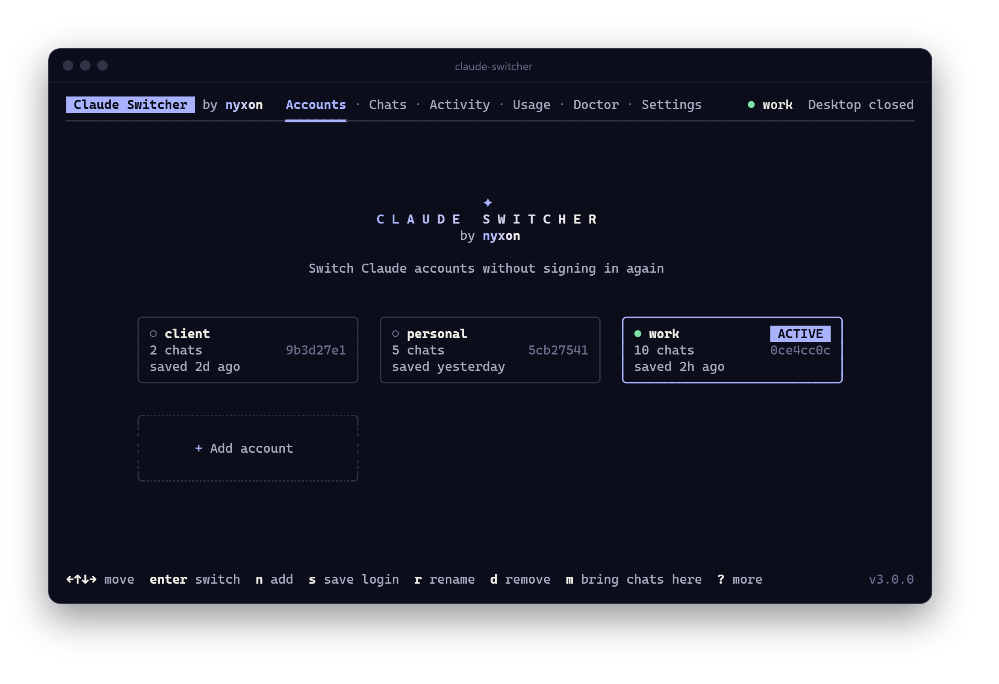
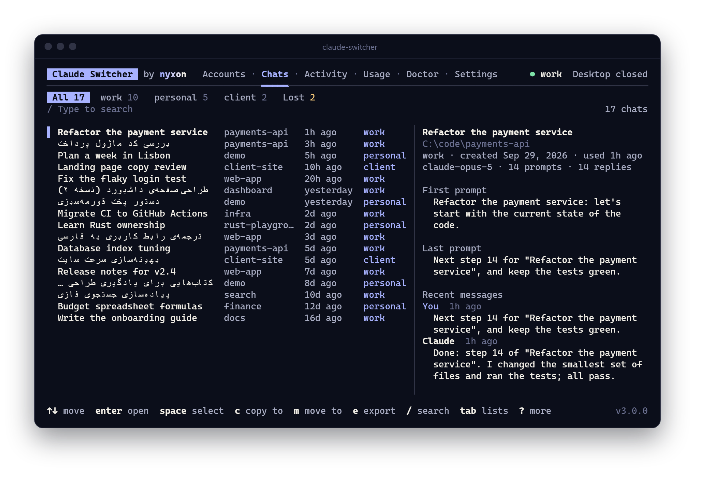
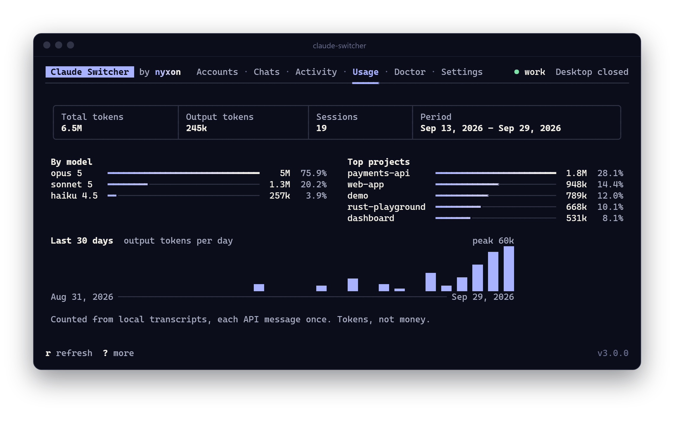
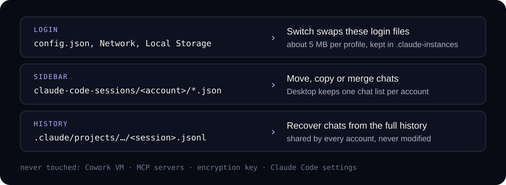

<p align="center">
  
</p>

<h1 align="center">Claude Switcher</h1>

<p align="center">
  Switch Claude Desktop between your accounts without signing in again,<br>
  and keep every Claude Code chat with you, on Windows, macOS and Linux.
</p>

<p align="center">
  <a href="https://github.com/nyxon-tech/claude-switcher/releases/latest"></a>
  <a href="https://github.com/nyxon-tech/claude-switcher/actions/workflows/ci.yml"></a>
  
  <a href="./LICENSE"></a>
</p>

Claude Desktop is signed into one account at a time. Switching means logging out and back in, and every account keeps its own Code sidebar, so the chats you had a minute ago look gone.

**Claude Switcher** saves each login once and switches between them in seconds. It shows the Code chats of every account in one place, copies or moves them to whichever account you are using, brings back chats that fell out of the sidebar, and undoes any of it. It is a single binary that only touches files on your computer.

## Install

**Windows** (PowerShell)

```powershell
irm https://raw.githubusercontent.com/nyxon-tech/claude-switcher/main/install.ps1 | iex
```

**macOS and Linux**

```sh
curl -fsSL https://raw.githubusercontent.com/nyxon-tech/claude-switcher/main/install.sh | sh
```

Both scripts download the latest release, check it against the published SHA-256 checksums, and install it for your user only, with no admin rights. Then run `claude-switcher`. You can also download an archive from [Releases](https://github.com/nyxon-tech/claude-switcher/releases/latest), or build it with `go install github.com/nyxon-tech/claude-switcher/v3/cmd/claude-switcher@latest`.

Already on v2? Run the same line. Your saved logins in `~/.claude-instances` carry over unchanged.

## Every account, every chat

<p align="center">
  
</p>

The Chats tab lists the Code chats of every account together. Start typing to search titles and projects, open a preview of any chat, tick chats with Space, and **copy** them (they show up in both accounts) or **move** them. When the other account already has a chat, the newer copy wins, so a chat you kept working on in one account carries over. Export any chat as a web page or Markdown.

**Lost** shows conversations whose history is still on disk but that no sidebar lists, after an account switch, a reinstall or an update. Recover them and they are back in Claude Desktop with their title, project and dates.

Chat titles in Persian, Arabic or Hebrew display correctly, letters joined and right to left, even in terminals that cannot lay out right-to-left text themselves, such as Windows Terminal.

## What it does

| | |
| --- | --- |
| **Switch accounts** | Swap to another saved login and reopen Claude Desktop. No password, no email code. |
| **Add an account** | Saves the login in use, then opens Desktop signed out so you can add the next one, without ever pressing Log out. |
| **Copy, move, merge** | Chat by chat between any two accounts, or bring every chat into one account. Newest copy wins. |
| **Recover** | Rebuilds sidebar entries for chats that only exist as history on disk. |
| **Undo** | Every chat change is journaled with backups, so undo puts back every byte. |
| **Usage** | Tokens by model, by day and by project, counted from your local transcripts. |
| **Doctor** | Checks the install, the signed-in account and every chat list, and warns about settings that delete history. |
| **Scriptable** | Every action is also a command, with `--json` output and stable exit codes. |

<p align="center">
  
</p>

## How it works

Claude Desktop keeps three things on disk, and Claude Switcher treats each one differently.

<p align="center">
  
</p>

- **Switching** copies Desktop's login files (`config.json`, cookies, local storage, a few MB) between its data folder and `~/.claude-instances/<profile>`. Desktop has to be closed for this, because it rewrites those files when it quits: Claude Switcher asks it to quit (on Windows you quit it from the tray icon), waits, swaps, and opens it again.
- **Chats** live in two places. The history is one file per conversation, shared by every account. The sidebar is a small record per chat, kept separately for each account. Copying a chat copies that record; the history is only ever read.
- **Safety.** Before saving over a login it checks that Desktop is still signed into that same account, and refuses otherwise. Every chat change is journaled with backups first. Records are written the way Desktop expects them, and fields it does not know are kept byte for byte. The only network request is the optional daily check for a new release.

| | Windows | macOS | Linux |
| --- | --- | --- | --- |
| Desktop data | `%LOCALAPPDATA%\Packages\Claude_pzs8sxrjxfjjc\LocalCache\Roaming\Claude` (or `%APPDATA%\Claude`) | `~/Library/Application Support/Claude` | `~/.config/Claude` |
| Chat history | `%USERPROFILE%\.claude\projects` | `~/.claude/projects` | `~/.claude/projects` |
| Saved logins | `%USERPROFILE%\.claude-instances` | `~/.claude-instances` | `~/.claude-instances` |

<details>
<summary><b>All commands</b></summary>

```text
claude-switcher                                 open the app
claude-switcher list                            saved accounts and chat lists
claude-switcher switch <profile>                switch Claude Desktop to a saved account
claude-switcher save <name>                     save the account Desktop is signed into
claude-switcher add <name>                      get Desktop ready to sign into another account
claude-switcher rename <old> <new>              rename a saved account
claude-switcher remove <name>                   forget a saved account; its chats stay

claude-switcher chats [list] [--lost]           chats, newest first, or the ones to recover
claude-switcher copy --from A --to B <ids...>   copy chats to another account
claude-switcher move --from A --to B <ids...>   move chats to another account
claude-switcher merge --to <list>               bring every chat into one account
claude-switcher rescue [--to <list>] [--all]    recover chats no sidebar shows
claude-switcher export <id> [--format md]       save a chat as a web page or Markdown
claude-switcher undo                            undo the last change
claude-switcher history                         every change made

claude-switcher usage                           tokens by model and project
claude-switcher doctor                          check the setup
claude-switcher config [get|set|list]           settings
claude-switcher update                          update to the latest release
claude-switcher version                         version and build details
```

Global flags: `--json`, `--yes`, `--no-launch` (leave Desktop closed), `--theme`, `--rtl auto|app|terminal|off` (how right-to-left chat titles are drawn). Exit codes: 0 done, 1 error, 2 wrong usage, 3 refused by a safety check, 4 not found, 5 cancelled.

</details>

<details>
<summary><b>Questions</b></summary>

**Does it log me out of anything?** No. It never presses Log out and never signs in for you. Logging out can end a saved login, which is why *Add an account* opens Desktop signed out instead.

**Where are my logins stored, and is that safe?** In `~/.claude-instances`, as copies of the same files Desktop keeps in its own folder, readable only by your user. The cookies in them are encrypted with a key that stays with your user account on this computer, so a copy is useless elsewhere. Do not share or sync that folder.

**Can I use it with a terminal-only Claude Code?** Chats you ran in a terminal show up under Lost, and you can recover them into any account's sidebar.

**Why do Persian titles look right here but not in other tools?** Windows Terminal and most terminals do not join Arabic-script letters or lay out right-to-left text. Claude Switcher does both itself when the terminal cannot, and leaves the text alone in terminals that can (macOS Terminal, iTerm2 3.7+, Konsole). If a title ever looks mirrored, change *Right-to-left text* in Settings.

</details>

## Build from source

```sh
git clone https://github.com/nyxon-tech/claude-switcher
cd claude-switcher
go test ./...
go run ./cmd/claude-switcher
```

`go run ./tools/demodata -out demo` writes a made-up setup (three accounts and a few dozen chats) to try everything without touching your real Claude folders, and prints the flags that point Claude Switcher at it. See [docs/ARCHITECTURE.md](./docs/ARCHITECTURE.md) for how the code is organised.

## Credits

Claude Switcher started as a fork of **[claude-profile-switcher](https://github.com/NeezerGu/claude-profile-switcher) by [@NeezerGu](https://github.com/NeezerGu)**, which worked out which of Desktop's files make up a login and how to swap them safely around the Cowork VM. Thank you for building it and sharing it under MIT; this project would not exist without it.

Built with [Bubble Tea, Lip Gloss and Fang](https://github.com/charmbracelet) by Charm.

Unofficial. Not affiliated with or endorsed by Anthropic. Claude is a trademark of Anthropic.

<p align="center">
  <a href="https://github.com/nyxon-tech"></a>
</p>
